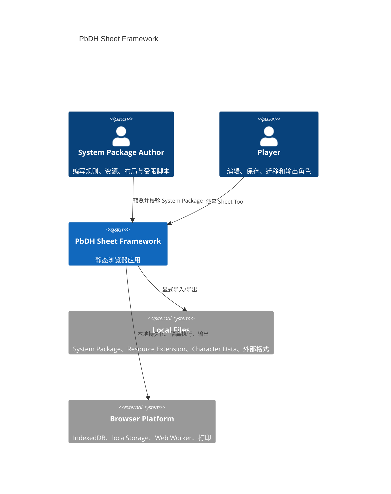
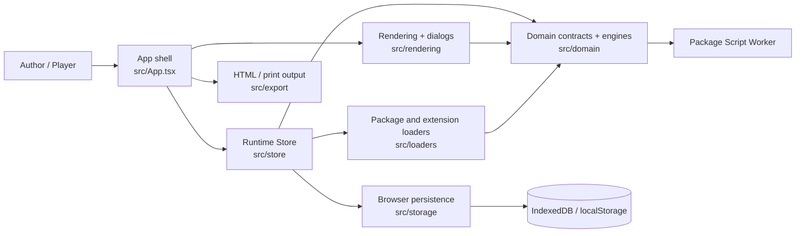
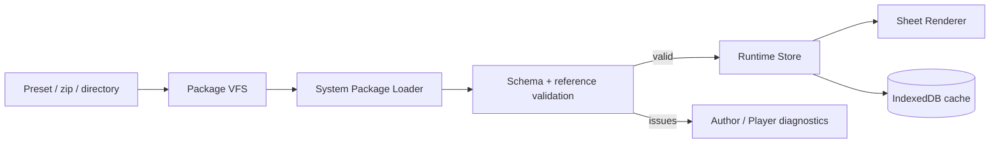
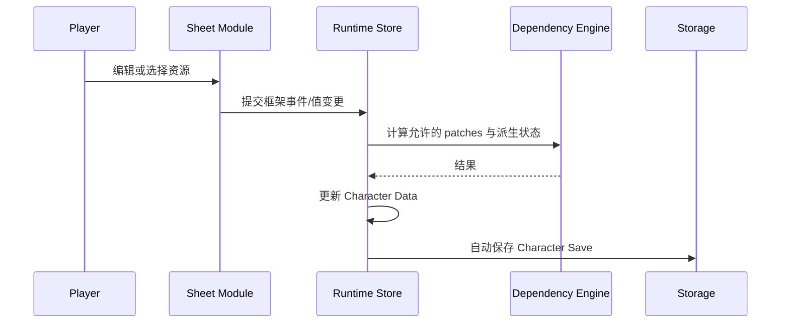
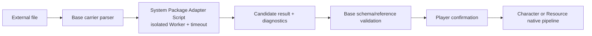

# PbDH Sheet Framework 当前架构

## 文档职责

本文是“系统当前如何工作”的唯一架构概览。它描述运行形态、主要边界和关键数据流，不复制 System Package 字段合同，也不充当决策日志。

- 产品意图与非目标：[PRD](PRD.md)
- 领域词汇：[CONTEXT.md](../CONTEXT.md)
- 决策理由与历史：[ADR 索引](adr/README.md)
- Author-facing 精确合同：[System Package 合同手册](system-package/README.md)
- 发布与部署操作：[release.md](release.md)

## 架构约束

- 应用是通过 HTTPS 提供的静态浏览器应用，没有服务器 API、账号或云同步。
- 当前不注册 Service Worker，也不提供 PWA 安装或离线应用壳；见 [ADR-0030](adr/0030-static-web-without-pwa-or-server-api.md)。
- 同一运行时只激活一个 System Package；可选择构建时预置包，也可导入本地 zip 或目录。
- Character Data、System Package 缓存、额外资源与少量偏好保存在浏览器本地。
- System Package 通过公开声明式合同、两个受限 Worker 脚本 seam（Validation Script 与 Format Adapter Script），以及一个隔离的 Questionnaire HTML seam 扩展。
- Guide、Dependency、Validation、Card 与 Storage 各自拥有独立职责，不能绕过 Character Data 和 Runtime Store 的写入路径。

## 系统上下文

网络只负责取得静态构建产物。用户数据和导入文件不会由应用上传到 PbDH 服务端。

## 容器与代码边界

### `src/domain`: 合同与纯规则

- System Package 与 Character Data 的 schema、Validator 和归一化合同；
- Dependency Engine、Card Engine、Guide session 与 Countable 状态；
- Resource Library、Resource Extension、Effective Resource Catalog 与 Composite Resource；
- Character/Resource Format Adapter 和 Validation Runner；
- Package Script 的消息合同、Worker 执行、超时与结果校验。

这一层不渲染 UI，也不直接读写浏览器存储。

### `src/loaders`: 文件边界

- 将 zip、目录句柄或构建时预置目录读取为统一的包内虚拟文件系统；
- 校验路径、解析 manifest 引用并生成运行时 System Package；
- 发现和解析来源范围内 assets；
- 导入 Resource Extension，并保持其来源和资产命名空间。

Loader 负责“文件如何进入系统”，Domain 负责“进入后的数据是否合法”。

### `src/store`: 应用协调

Zustand Runtime Store 持有当前包、角色、有效资源目录、派生状态、加载/诊断状态和用户偏好。它协调 Loader、Domain Engine 与 Storage，是 UI 触发状态变更的统一入口。`src/App.tsx` 负责顶层生命周期和对话框/输出流程，不承载格式或规则特有转换。

### `src/storage`: 浏览器持久化

- IndexedDB 保存 System Package 缓存、Character Saves、Resource Extensions 及相关元数据；
- System Package 缓存记录预制、本地导入或 Author Preview 来源；预制缓存同时记录创建它的 Base Framework 发布版本；
- localStorage 只保存小型偏好或当前选择标识；
- Player 图片以 data URL 集中嵌入 Character Data 的 `playerImages`，Sheet Value 只保存引用；
- System Package assets 保持包内稳定引用，不复制进 Character Data。

浏览器站点数据不是云备份。跨设备恢复依赖显式导出文件。

### `src/rendering`: 框架拥有的交互面

Sheet Renderer 解析已消毒的 HTML Layout Template，在 `<pb-module>` 位置挂载 Module Registry 中的框架组件。当前模块类型以 `moduleRegistry.tsx` 和 System Package schema 为可执行事实，包括文本、计数、勾选、图片、只读展示、资源选择/组合与卡牌桌。

页面 CSS 和 Skin CSS 都被限制在 System Package 展示范围；App Shell 使用独立的框架配色。Resource Browser/Manager、Guide Spotlight 与导入导出对话框仍由 Base Framework 拥有。

Questionnaire HTML 是独立的展示/推荐应用，不进入 Sheet Renderer。Base 在新标签页中创建受信任 Host，并把 Author HTML 放进无同源权限的 sandbox iframe；Host 只接收有序 Resource Picker 结果，主页面再次校验引用并显示 Base-owned 确认对话框。

### `src/export`: 输出

输出流程准备全部可打印页面，等待文字拟合和可见图片加载，运行输出前检查，然后生成只读 HTML snapshot 或交给浏览器打印。System Package 决定打印内容和内边距，框架负责稳定输出过程。

## 核心状态与所有权

| 状态 | 所有者 | 持久化 |
|---|---|---|
| 当前 System Package | Runtime Store | IndexedDB 缓存或构建时预置来源 |
| Character Data | Domain contract / Runtime Store | Character Save；可导入导出 |
| Player 图片 | Character Data | 随角色 JSON |
| Resource Extensions | Runtime Store / Storage | IndexedDB；可单独导入 |
| Effective Resource Catalog | Domain 派生 | 从基础库与扩展重建 |
| Dependency 派生展示状态 | Dependency Engine / Runtime Store | 从允许的 source snapshot 重建，不保存最终结果 |
| Guide session、对话框、加载进度 | UI / Runtime Store | 不持久化 |
| Skin 与框架配色偏好 | Runtime Store | 小型本地偏好 |

## 关键数据流

### 加载 System Package

包切换会重新建立资源、资产 URL 和派生状态；渲染组件不自行读取文件。

构建只把预制包的轻量目录和每个包的清单 URL 放入入口 JS；具体文件清单输出为各包独立的 `.pbdh-files.json`，选中或恢复该包时才请求。预制包文件与清单请求都携带发布版本作为 cache-busting 参数。

启动恢复当前包时，Runtime Store 只会自动刷新来源为构建预置且 Base Framework 发布版本已变化的缓存。本地导入与 Author Preview 包不会被发布升级覆盖。刷新失败时继续使用已校验的旧缓存并报告 warning。该过程保留 Character Saves、Resource Extensions 与偏好。缓存恢复只运行不依赖完整 Validator 的轻量一致性检查；导入或重新加载包时再异步加载完整 Validator。

### 编辑与自动保存

Dependency Engine 只响应公开事件并返回有限 patch；它不直接访问 DOM 或 Storage。加载时只重建被合同标记为纯派生的结果，不通用重放有副作用的动作。

### 资源扩展

基础 Resource Libraries 与零个或多个 Resource Extensions 按来源分层合并为 Effective Resource Catalog。资源身份包含来源范围，资产也按来源解析。角色引用有效目录中的稳定资源身份；冲突、替换和移除由 Runtime Store 通过确认流程处理。

### 外部格式导入/导出

脚本只接收 structured-clone 输入，不能访问 DOM、存储或实时状态。Base Framework 始终拥有文件安全、原生数据验证、确认和持久化。

### Guide 与 Validation

- Guide 是无分支的展示型聚光灯：只负责说明、导航、滚动和高亮，不读取 Character Data，也不触发业务动作。
- Validation Script 在 Worker 中读取角色与资源副本并返回报告；不能修改 Character Data。
- 框架自身检查与包检查在手动检查、导出和打印前汇总。

### Questionnaire Character Creation

问卷问题、计分、推荐与动画完全属于 System Package。问卷返回的不是 Character Data patch，而是现有 Picker、Library 与稳定 Entry ID 的有序选择；Runtime Store 在草稿上重放与手动 Picker 提交相同的 Dependency/Card/派生链路，Player 确认后原子替换 Character Data 并保存一次。可选 Resource Extension 尚未安装而导致 Entry 缺失时，确认界面显示缺失 ID、跳过对应选择，并允许 Player 应用其余可用项；全部缺失时不能确认。取消、其他无效结果或过期结果不产生写入，也不要求 Author 修改既有 `dependencies.json`。

## 安全边界

- 包内路径必须相对根目录，不能越界或引用外部 URL；
- HTML/CSS 经白名单与 scope 处理，禁止脚本、事件属性和全局污染；
- Questionnaire HTML 只在 `sandbox="allow-scripts"` 的不透明 origin iframe 内执行，并由 CSP 禁止网络、表单、子框架、对象和外层导航；
- Package Scripts 在独立 Worker 中按固定接口、输入副本和超时运行；Worker 是执行隔离边界，不宣称能安全运行主动恶意代码；
- 所有脚本结果必须再次通过 Base schema 与引用校验；
- Character Import 不安装 Resource Extension，Resource Import 不修改 Character Data；
- Guide 和渲染组件不能直接获得 Storage mutation capability。

## 构建、部署与验证

Vite/TypeScript 产出静态文件。完整 System Package Validator、Restricted Markdown 解析器及非首屏对话框/输出能力按需加载。构建后的入口、首屏 module preload 与 gzip 总量受 `scripts/check-bundle-budget.mjs` 检查，且首屏 JS 不得内嵌卡图文件清单。

GitHub Release workflow 负责版本校验、测试、构建与不可变发布产物；Deploy workflow 只提升已有 Release。生产服务器通过原子切换激活不可变 release，细节见 [release.md](release.md)。

架构变更至少应同步：

1. 对应源码与测试；
2. 需要理由时新增或替代 ADR；
3. 本文的当前架构概览；
4. 如果改变 Author 合同，同步 System Package Reference 与示例。

不要在 PRD、CONTEXT 或另一份 C4 文档复制当前模块清单和数据合同。
