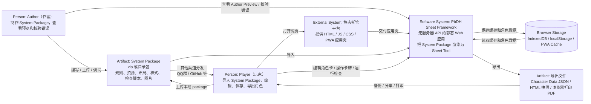
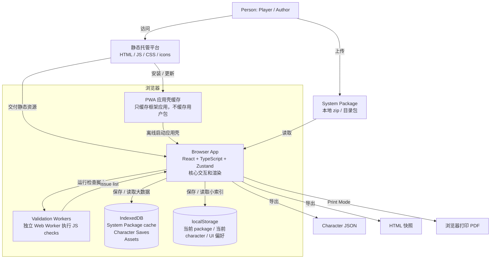
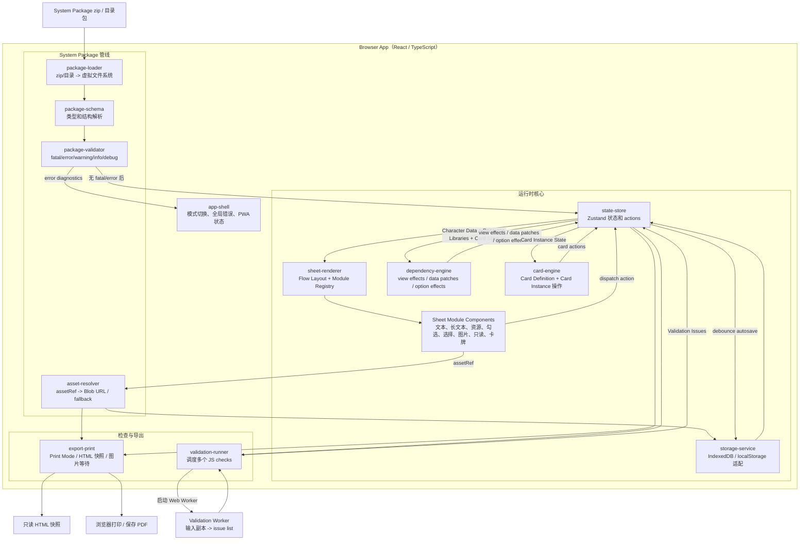
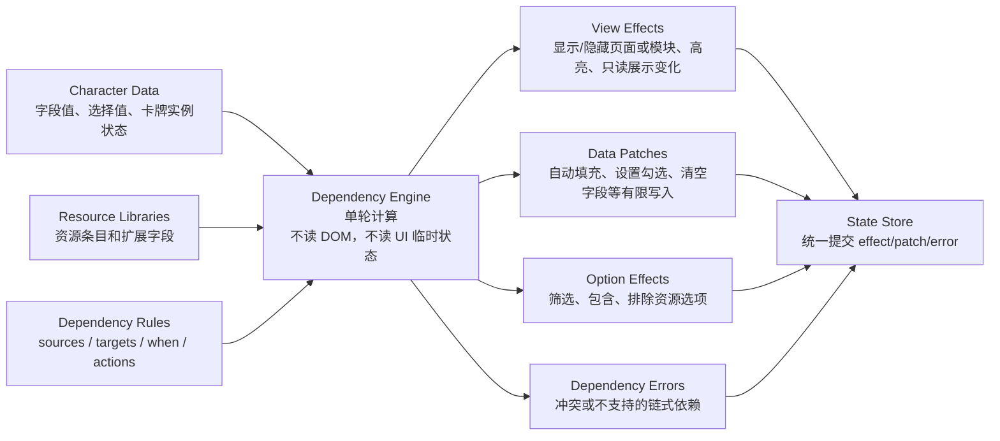
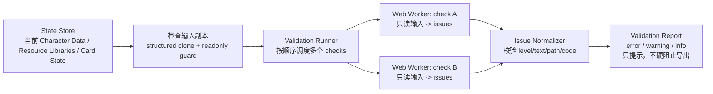

# PbDH Sheet Framework C4 架构图

状态：Draft  
日期：2026-07-06

本文基于 `docs/PRD.md` 和 `docs/adr/` 画出 C4 Level 1-3。Level 4 Code 图暂不画；当前还没有实现代码，过早画类/函数层会变成伪精确。

## Level 1：系统上下文图

## Level 2：容器图

## Level 3：Browser App 组件图

## Level 3：关键边界放大图

### Dependency Engine 边界

### Validation Script Runner 边界

## 不画的 C4 图

- 不画 Level 4 Code 图：当前没有代码，类和函数名会过早锁死。
- 不画服务器端容器：第一版没有服务器 API，只有静态托管平台。
- 不画数据库服务：IndexedDB/localStorage 是浏览器本地存储，不是独立后端数据库。
